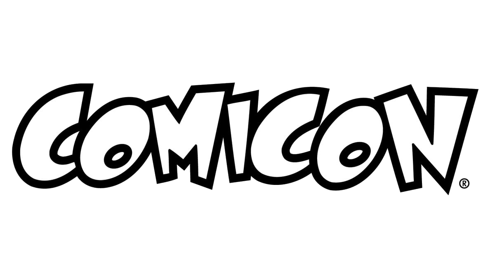

# 📅 Programma Evento

### 👤 Erin
* **Giovedì:** Mattina – *Showcase*
* **Venerdì:** Tardo pomeriggio – *Firmacopie*
* **Sabato:** Pomeriggio – *Raduno Twisted*
* **Domenica:** Pranzo/Post-pranzo – *Set fotografico + Raduno*

### 👤 Milo
* **Sabato:** Giornata con amici durante il raduno.
* > ⚠️ **Nota:** Si staccherà dal gruppo durante i raduni.

### 👤 Frisk
* **Giovedì:** Mattina – *Showcase*
* **Sabato:** Pomeriggio – *Raduno Twisted Wonderland*

### 👤 Dante (Frisk)
* **Giovedì:** Mattina – *Showcase*
* **Sabato:** Pomeriggio – *Raduni DMC e Twisted Wonderland*
* *Nota: Possibili impegni last-minute o giornata Neverland random.*

---

## 🗓️ Tabella di Riepilogo

| Giorno | Erin | Milo | Frisk | Dante |
| :--- | :--- | :--- | :--- | :--- |
| **Giovedì** | Showcase (Mattina) | - | Showcase (Mattina) | Showcase (Mattina) |
| **Venerdì** | Firmacopie | - | - | - |
| **Sabato** | Raduno Twisted | Con amici | Raduno Twisted | Raduni DMC & Twisted |
| **Domenica** | Set Foto + Raduno | - | - | - |

  

  

